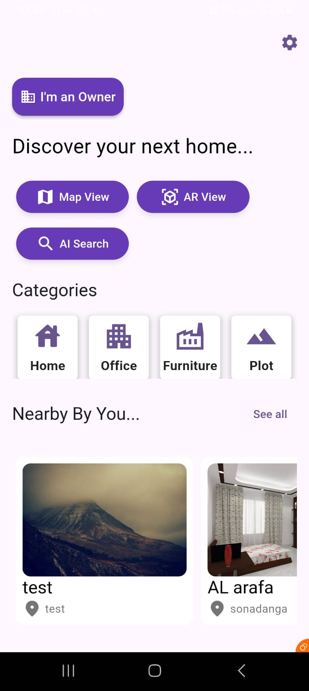
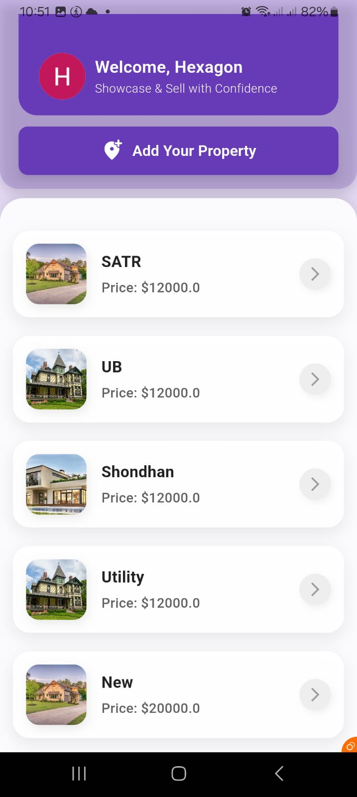
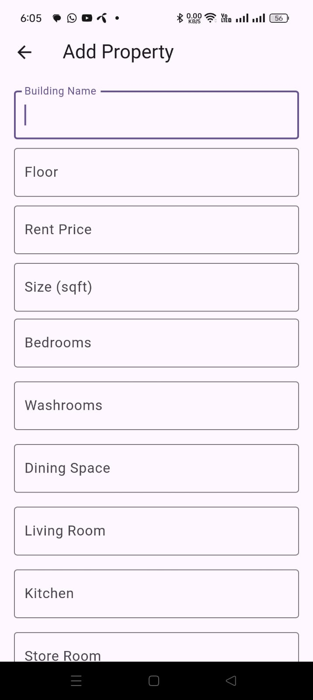
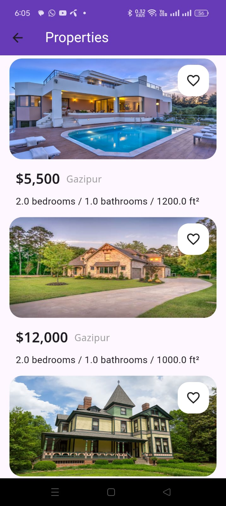
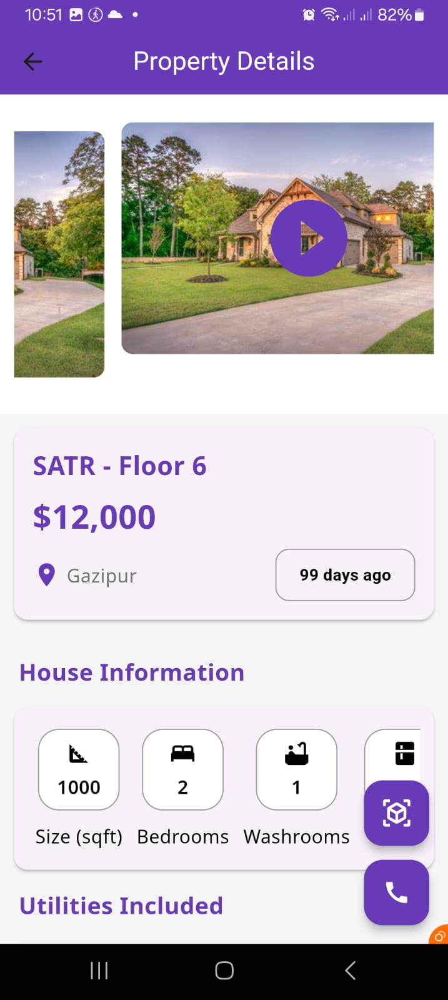
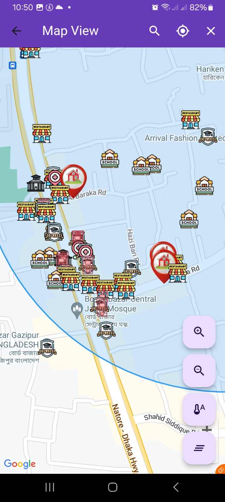
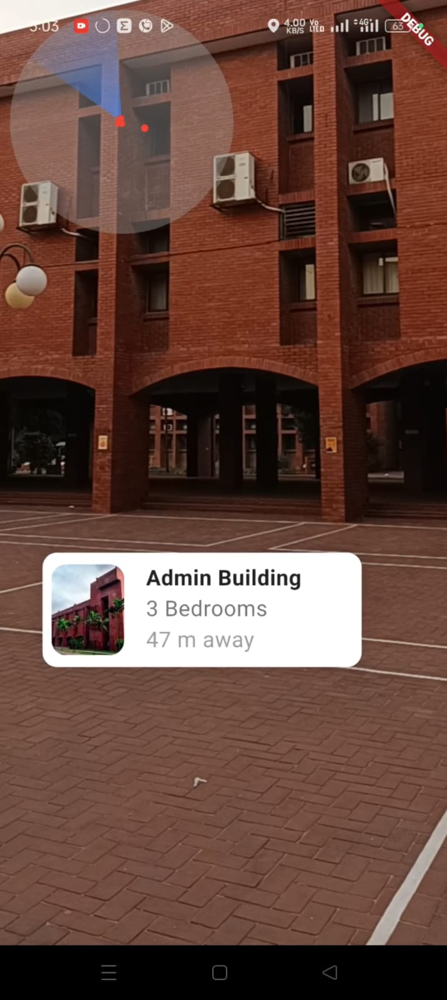
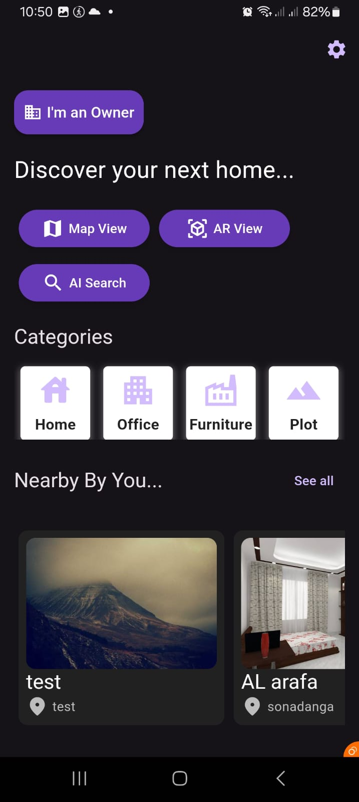
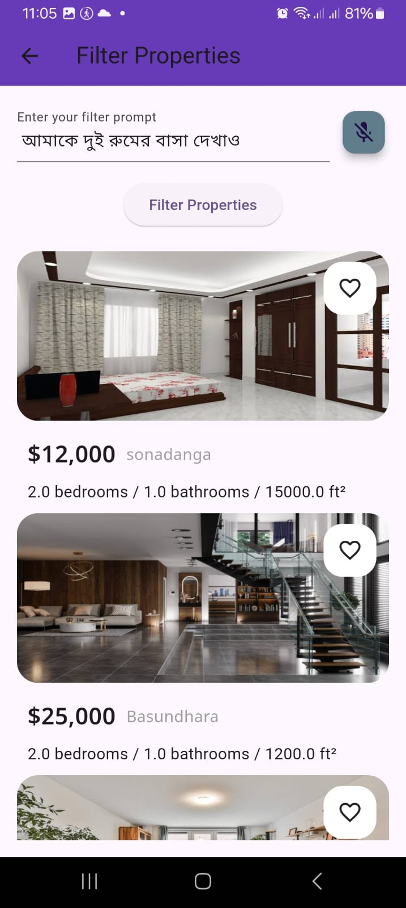

# TeamHexagon Shondhan Report

## Department of Computer Science and Engineering  
Islamic University of Technology (IUT)  
A subsidiary organ of OIC  

### **Project Deliverables**  
**Course:** CSE 4510 - Software Engineering and Object-Oriented Design Lab  

**Team Name:** Team Hexagon  

**Team Members:**  
1. Sakib Ahmed Shanto - 210041262  
2. Sadia Afrin - 210041209  
3. Nabila Newaz - 210041216  
4. Meftahul Jannati Anonna - 210041227  
5. Nafisa Haque - 210041231  
6. Khan Mahi Al Atahar - 210041260  

**Section:** 2(A)  
**Semester:** 5th  
**Academic Year:** 2023-24  
**Date of Submission:** 20.03.2025  

---

## **Project Deliverables**  
- **[View Project Source Code](https://github.com/sakibahmedshanto/shondhan.git)**  
- **[View Bug Report](https://docs.google.com/spreadsheets/d/16xJswn7lR6BTRcHPRJp8W1omGXjb-ZDTQqtJxZtK1gI/edit?usp=sharing)**  
- **[View Project Report](https://docs.google.com/document/d/1BeEpd__OTCpxHeYKN5b7C9Ro9MUDb-HyKxfenKzIXwM/edit?usp=sharing)**  
- **[View Presentation Slides](https://www.canva.com/design/DAGa6qbSR8k/7g5_0R-SLOUc3FbtSBFB1g/view?utm_content=DAGa6qbSR8k&utm_campaign=designshare&utm_medium=link2&utm_source=uniquelinks&utlId=hc5555cdcf1)**  
- **[View Video Demonstration](https://youtu.be/HSKvZhBZuLE?si=f6S_C8uNL2vuiIzy)**  
- **[View Usability Report](https://docs.google.com/spreadsheets/d/1YCB3Gr9BYQ6Jso6IIdHlku9VYqhu9Nxpf3FmY9_sjSc/edit?fbclid=IwY2xjawJJGFJleHRuA2FlbQIxMAABHTkswYJDBwsuoQKmLcZoipZLtwVDxJIP9eXRb_xTcUdlYFvtZ6c84QyIpg_aem_4TB8k8A4bz9IMWZ_d3BtCw&gid=693826705#gid=693826705)**  

---

## **Screenshots**  
  
 
 
 
 
 
 
 
 
 
 
 
 
 
 
 
 

---

# TeamHexagon Shondhan Report
  

---

## **Table of Contents**  
1. [Introduction](#introduction)  
2. [Requirements](#requirements)  
   - [Functional Requirements](#functional-requirements)  
   - [Non-functional Requirements](#non-functional-requirements)  
3. [Design Prototype](#design-prototype)  
4. [Source Code](#source-code)  
   - [Software/Hardware Summary](#software-and-hardware-summary)  
5. [Project Evaluation Report](#project-evaluation-report)  
   - [Test Cases](#test-cases)  
   - [Test Execution Results](#test-execution-results)  
   - [Analysis](#analysis)  
6. [Conclusion](#conclusion)  

---

## **Project Title**  
**Shondhan**  
*"An Augmented Reality Based Property Finding Application"*

---

## **Introduction**  

Shondhan is an innovative property-finding application developed by Team Hexagon. It simplifies real estate searches using **Augmented Reality (AR)** and **Artificial Intelligence (AI)**.  

### **Purpose of Shondhan**  
Shondhan aims to:  
✅ Streamline property searches with **real-time AR visualization**  
✅ Use **AI-powered tools** to enhance search experience  
✅ Provide **data-driven property insights**  

### **Problem Statement**  
Traditional property search methods are **slow**, **lack interactivity**, and **fail to provide relevant insights**.  

### **Key Features**  
- **🔍 Real-Time AR Visualization**: Virtual property exploration  
- **🗺️ Intuitive Map Navigation**: Integrated map for easy discovery  
- **🤖 AI-Powered Search**: Natural language-based property search  
- **📊 Predictive Analytics**: Crime score & price prediction  
- **🏡 3D Home Interior Views**: Enhanced property insights  

---

## **Requirements**  

### **Functional Requirements**  
1. **Real-Time AR Visualization** - View properties in real-time  
2. **Map-Based Navigation** - Search properties near specific locations  
3. **AI-Powered Search** - Supports natural language queries  
4. **Crime Score & Price Prediction** - Provides property analytics  
5. **3D Model Interior View** - Explore property interiors  
6. **User Dashboards** - Owners and buyers have separate portals  

### **Non-Functional Requirements**  
- **Performance & Scalability** - Optimized real-time data handling  
- **Usability & Accessibility** - **Flutter-based UI**, dark mode, voice search  
- **Security & Reliability** - Firebase authentication & encrypted storage  

---

## **Design Prototype**  
[🔗 View in Figma](https://www.figma.com/proto/BLZjYCeh54Kxi9KmLeWMKl/Project-Prototype)  
  

---

## **Source Code**  
[🔗 GitHub Repository](https://github.com/sakibahmedshanto/shondhan.git)  

### **Software and Hardware Summary**  
- **Tech Stack:** Flutter, Dart, Firebase, Google Maps API, ARCore  
- **AI/ML Libraries:** Flask, NumPy, Pandas, scikit-learn  
- **Database:** Firestore, PostgreSQL, SQLite  
- **Hardware Requirements:** AR-compatible devices, GPS-enabled smartphones  

---

## **Project Evaluation Report**  

### **Test Cases**  
| Test ID | Test Case | Expected Result | Status |  
|---------|----------|----------------|--------|  
| TC_01 | User login | Successful login | ✅ Pass |  
| TC_02 | AI property search | Relevant properties displayed | ✅ Pass |  
| TC_03 | AR property visualization | AR loads correctly | ✅ Pass |  
| TC_04 | Secure messaging | Messages sent & received | ✅ Pass |  

 

### **Test Execution Results**  
📊 **Total Test Cases Executed**: 20  
✅ **Passed**: 20  
❌ **Failed**: 0  

---

## **Analysis**  
- **App Load Time:** **2.8s** (Optimized)  
- **AI Search Time:** **1.5s** (Fast response)  
- **AR Feature Load Time:** **4.2s** (Within acceptable range)  

### **Key Takeaways**  
✔️ **AI-powered search** is highly efficient  
✔️ **AR-based property visualization** is smooth  
✔️ **Security measures** are strong  
✔️ **Performance is optimized** with minimal load time  

---

## **Conclusion**  

Shondhan is an innovative **AI + AR-powered** real estate app that redefines property searching.  

### **Future Enhancements**  
🚀 Further optimize **AI search algorithms**  
📌 Improve **AR model positioning**  
⚡ Optimize **database scalability**  

🔗 **[View Bug Report](https://docs.google.com/spreadsheets/d/16xJswn7lR6BTRcHPRJp8W1omGXjb-ZDTQqtJxZtK1gI/edit?usp=sharing)**  
 

